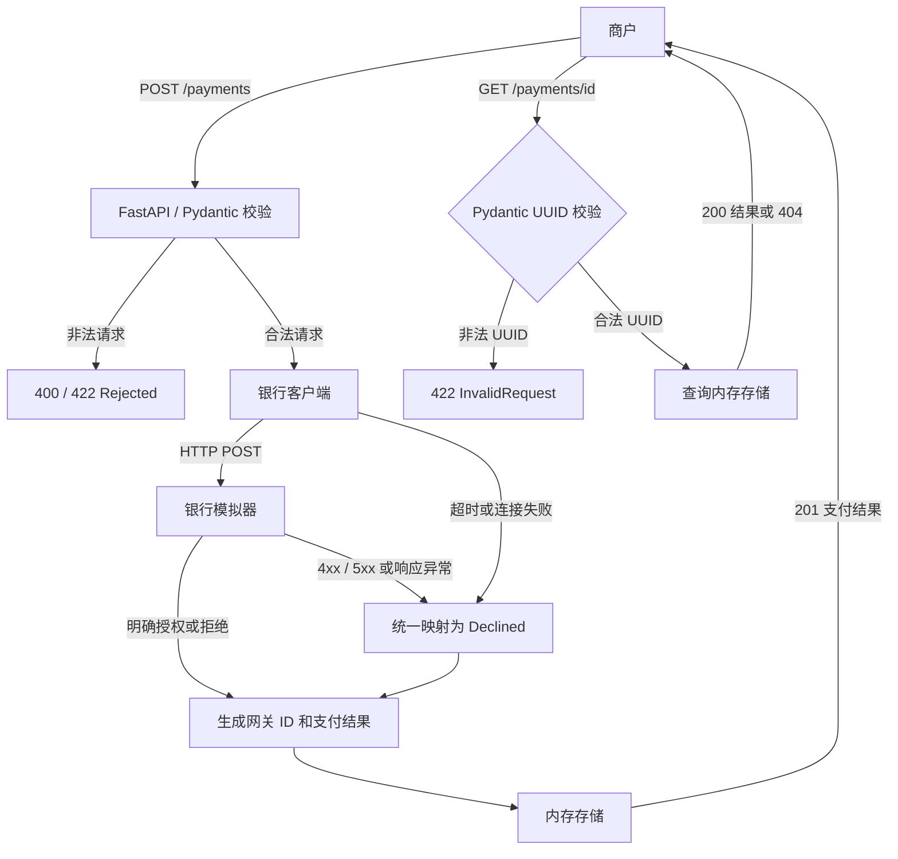

# Payment Gateway 设计文档

状态：2026-10-05 已完成最终复核。本文记录实际接口、配置、代码组织及 offline take-home 的取舍；运行命令见 README，验证结果见第 12 节。

## 1. 要解决什么问题

商户提交银行卡信息和支付金额，网关先检查请求是否合法，再调用题目提供的 acquiring bank simulator，将银行响应或调用失败映射为支付结果，保存结果，并允许商户通过 payment ID 查询。

本题实现两个业务接口：

| 接口 | 职责 |
| --- | --- |
| `POST /payments` | 校验请求、调用银行、保存并返回支付结果 |
| `GET /payments/{payment_id}` | 查询已保存的支付结果，不再次调用银行 |

保留模板已有的 `GET /`，作为现有的应用探活接口，不赋予它额外业务职责。

要求来源：[官方完整题目](https://github.com/cko-recruitment)、[处理支付](https://github.com/cko-recruitment#processing-a-payment)、[查询支付](https://github.com/cko-recruitment#retrieving-a-payments-details)、[实现要求](https://github.com/cko-recruitment#implementation-considerations)。本地 `README.md` 规定不修改 `.editorconfig` 和 `imposters/`。

## 2. 范围与总体方案

使用现有 FastAPI 模板、Pydantic 请求校验、HTTPX 异步 HTTP 客户端和进程内存字典。应用作为单进程、单 worker 的本地服务运行。



只处理题目中的授权请求和结果查询。`Authorized` 表示银行授权成功，不代表本题实现了后续 capture、结算或资金到账。

不实现真实数据库、商户认证、退款、消息队列、后台任务、支付幂等、自动重试、多银行路由或分布式部署。这些能力不影响本题两个功能的展示，但它们的缺失需要在假设和限制中说明。

## 3. 支付状态与 HTTP 状态码

业务状态回答“这次支付请求的结果是什么”，HTTP 状态码回答“这次 API 调用发生了什么”。二者不能混为一谈。

| 情况 | HTTP 状态码 | 响应中的业务状态 | 调用银行 | 保存支付 |
| --- | --- | --- | --- | --- |
| 请求编码无法解析，例如非法 UTF-8 | `400` | `Rejected` | 否 | 否 |
| JSON 或字段校验失败 | `422` | `Rejected` | 否 | 否 |
| 银行明确授权 | `201` | `Authorized` | 是 | 是 |
| 银行明确拒绝 | `201` | `Declined` | 是 | 是 |
| 银行返回 5xx，包括模拟器的 503 | `201` | `Declined` | 是 | 是 |
| 无法连接银行或其他传输错误 | `201` | `Declined` | 尝试调用 | 是 |
| 调用银行超时 | `201` | `Declined` | 尝试调用 | 是 |
| 银行返回 4xx、非预期状态或不合法响应 | `201` | `Declined` | 是 | 是 |
| 查询到支付 | `200` | 原先保存的 `Authorized` / `Declined` | 否 | 不新增 |
| 合法 UUID 对应的支付不存在 | `404` | 不返回支付状态 | 否 | 否 |
| 查询 ID 不是合法 UUID | `422` | 不返回支付状态 | 否 | 否 |

`Declined` 同样是一条已创建的支付记录，所以使用 `201`。这是本设计的 HTTP 约定，题目未指定 HTTP 状态码。

`Rejected` 是请求层面的拒绝，不是已创建的支付记录，因此不生成 payment ID，也不能通过查询接口获取。

为保持题目列出的 `Authorized` / `Declined` / `Rejected` 三种业务结果，本设计将银行 4xx/5xx、超时、连接失败及不合法响应统一映射为 `Declined`。这些请求已经通过网关校验，因此不映射为 `Rejected`。映射后的 `Declined` 与银行明确拒绝使用相同响应结构和存储方式。

这是本次 take-home 的简化假设，题目没有明确规定银行技术错误的映射方式。这里的 `Declined` 表示网关没有获得有效的授权成功结果，不保证银行实际未处理支付；具体限制见第 11 节。

## 4. 请求校验

### 4.1 输入字段

所有业务字段均必填，不接受 `null`。字段名称采用 snake_case，与银行模拟器及 Python 模板一致。

| 字段 | JSON 类型 | 校验规则 | 说明 |
| --- | --- | --- | --- |
| `card_number` | string | 14–19 个 ASCII 数字，即 `[0-9]` | 用字符串保留前导零；不接受空格或分隔符 |
| `expiry_month` | integer | 1–12 | 不接受字符串、浮点数或布尔值 |
| `expiry_year` | integer | 1–9999，且年月组合尚未过期 | 不单独要求年份大于当前年份 |
| `currency` | string | 仅接受 `GBP`、`USD`、`EUR` | 大写、严格匹配，限定三种币种 |
| `amount` | integer | 大于 0，单位为该币种的最小货币单位 | 不接受 `100.0`、`"100"` 或 `true` |
| `cvv` | string | 3–4 个 ASCII 数字 | 允许 `"012"`，不接受数字类型 |

Pydantic 使用严格类型约束，避免默认类型转换改变请求含义。只用 `int` 注解不足以表达“必须是 JSON 整数”，布尔值也需要明确拒绝。

额外字段默认忽略，不存储、不转发。网关向银行构造明确的字段白名单，避免把客户端原始 JSON 直接转交给下游。

不增加 Luhn、卡组织识别、银行卡 BIN 检查或额外的货币目录服务；题目只要求卡号长度和数字格式，额外校验可能拒绝模拟器使用的测试卡。

### 4.2 有效期规则

题目要求判断“月和年的组合”，但没有明确当月是否有效。本设计假设有效期持续到对应月份结束，因此使用 UTC 当前年月，接受：

```text
(expiry_year, expiry_month) >= (current_year, current_month)
```

例如，固定当前日期为 `2026-10-03 UTC` 时：

- `09/2026`：拒绝。
- `10/2026`：接受，假设卡在当月底失效。
- `11/2026`：接受，说明不能只检查年份是否更大。
- `01/2027`：接受。

这是对题目中 “in the future” 的显式解释，而不是题目明确规定的当月规则。实现采用本节规则；若契约改为严格晚于当前月份，需要同步调整比较和对应测试。

当前日期从一个可替换的小函数获取，测试使用固定日期，避免随着真实日期变化而失败。不引入独立时钟框架。

有效期过期是年月组合的业务错误，不能固定归为年份错误。例如 `09/2026` 在上述日期已过期，年份本身却有效。响应的 `error.details` 同时列出 `expiry_month` 和 `expiry_year`，均说明 “The combined expiry month and year must not be in the past.”。这表示两个字段共同参与规则，并非断定两个值分别错误。月份 13、年份 0 等字段约束错误只列出对应字段。

### 4.3 金额和其他输入假设

题目明确要求整数和最小货币单位，没有明确金额是否必须为正。本设计额外假设普通支付金额必须大于 0，零金额验证卡和负金额退款不在本题范围内。

例如，`GBP` 的 `1050` 表示 £10.50。内部和响应都保留整数，不转换成浮点金额。

`expiry_year` 使用 1–9999，便于构造四位年份格式；不再额外限制卡只能在未来若干年内过期。

### 4.4 校验失败的响应

支付 POST 沿用 FastAPI 的错误状态码：非法 UTF-8 等请求编码解析失败返回 `400 Rejected`；JSON 格式和字段校验失败返回 `422 Rejected`。两者共用安全的 Rejected 响应体，均不调用银行、不创建支付。自定义异常处理器负责响应内容，不转换框架状态码。GET 的非法 ID 返回 `422 InvalidRequest`。银行模拟器的状态码独立于网关，不决定网关的校验状态码。

为请求校验异常提供一个小型处理器，包括无法解析的 JSON、缺少字段、类型和业务约束错误。POST 校验失败示例：

```json
{
  "status": "Rejected",
  "error": {
    "code": "InvalidPaymentRequest",
    "message": "Payment request is invalid.",
    "details": [
      {
        "field": "card_number",
        "code": "InvalidValue",
        "message": "Must contain 14 to 19 ASCII digits as a string."
      }
    ]
  }
}
```

错误详情只输出固定字段名、错误类别和安全的描述。不能直接返回请求体、校验器原始 input/ctx、异常字符串或用户提供的字段名片段。无法解析的 JSON 使用统一消息，避免解析错误反射原始卡号或 CVV。

## 5. API 契约

### 5.1 `POST /payments`

请求：

```json
{
  "card_number": "2222405343248877",
  "expiry_month": 12,
  "expiry_year": 2030,
  "currency": "GBP",
  "amount": 1050,
  "cvv": "123"
}
```

银行明确授权后，返回 `201 Created`，并设置 `Location: /payments/{id}`：

```json
{
  "id": "66818204-2a2a-4a5d-9bdf-7192dbf91247",
  "status": "Authorized",
  "card_number_last_four": "8877",
  "expiry_month": 12,
  "expiry_year": 2030,
  "currency": "GBP",
  "amount": 1050
}
```

如果把示例卡号的末位改为 `8`，模拟器返回明确拒绝，网关仍返回 `201`，但 `status` 为 `Declined`，并生成新的 payment ID。

本设计用最后四位表示脱敏卡号，不额外生成星号掩码字符串。POST 和 GET 共用一个响应模型，避免字段或脱敏规则不一致。

### 5.2 `GET /payments/{payment_id}`

路径参数为 UUID。查询成功返回 `200 OK`，JSON 与该支付创建时的响应一致。查询只读取存储，不根据查询当天的日期重新验证卡片有效期。

未找到记录时返回 `404`：

```json
{
  "error": {
    "code": "PaymentNotFound",
    "message": "Payment was not found."
  }
}
```

非法 UUID 返回 `422`，错误码为 `InvalidRequest`，不附加 `Rejected` 支付状态。

### 5.3 银行调用失败时的响应

当银行返回 503、调用超时或连接失败时，网关仍创建并保存一条 `Declined` 支付，返回 `201 Created` 和 `Location: /payments/{id}`。例如银行不可用时：

```json
{
  "id": "c0aca1b2-e7f7-4cf4-bc47-235f8dd20237",
  "status": "Declined",
  "card_number_last_four": "8870",
  "expiry_month": 12,
  "expiry_year": 2030,
  "currency": "GBP",
  "amount": 1050
}
```

该 ID 可以通过 GET 查询，得到相同的 `Declined` 结果。对这些银行调用失败，网关不额外返回 502/503/504 或另一种业务状态，也不透传银行错误正文。仅在安全日志中区分银行明确拒绝与调用失败原因。

### 5.4 OpenAPI 文档

使用 FastAPI 自带的 `/docs` 和 `/openapi.json`，不额外引入文档框架。显式声明 POST 的 `201 PaymentResponse`、编码解析失败的 `400 Rejected` 和 JSON/字段校验失败的 `422 Rejected`，以及 GET 的 `200 PaymentResponse`、`422 InvalidRequest`、`404 PaymentNotFound` 响应。两个接口均声明 `500 ErrorResponse`，表示非预期网关错误；保留框架生成的 OpenAPI，不再手动移除 422，自动文档与实际处理一致。拒绝响应和普通错误响应使用简单、独立的响应模型。

## 6. 与银行模拟器的交互

### 6.1 请求转换

银行客户端向 `http://localhost:8080/payments` 发送一次 HTTP POST。按模拟器契约转换有效期：

```json
{
  "card_number": "2222405343248877",
  "expiry_date": "12/2030",
  "currency": "GBP",
  "amount": 1050,
  "cvv": "123"
}
```

`expiry_date` 的格式为 `MM/YYYY`，月份补齐两位，年份按四位格式输出。完整卡号和 CVV 只用于该次请求，不传入存储模型。

### 6.2 响应转换

| 模拟器结果 | 网关行为 |
| --- | --- |
| HTTP 200，`authorized` 严格为 `true` | 生成 `Authorized` 支付 |
| HTTP 200，`authorized` 严格为 `false` | 生成 `Declined` 支付 |
| HTTP 4xx / 5xx，包括模拟器的 503 | 生成并保存 `Declined` 支付 |
| 连接失败、超时或其他银行传输错误 | 生成并保存 `Declined` 支付 |
| 非预期 HTTP 状态或不合法响应 | 生成并保存 `Declined` 支付 |

必须先检查 HTTP 状态，再解析成功响应。只有 HTTP 200、JSON 为对象且 `authorized` 严格为 `true` 时才授权；缺少该字段、值为 `"false"`、`0`、`null` 或其他类型时，都视为不合法银行响应并映射为 `Declined`，不靠 Python 的 truthiness 判断。

转换仅覆盖银行交互中的 HTTP 状态、传输异常和响应解析/校验错误，不通过捕获所有异常把网关自身的编程错误或存储失败也伪装成 `Declined`。

模拟器提供的 `authorization_code` 不是网关的 payment ID。本题不需要用授权码完成后续操作，因此不保存、不返回它，也不增加围绕授权码的业务逻辑。

网关不能通过卡号末位自行决定状态。末位规则属于模拟器，实现必须发出真实 HTTP 调用并读取结果。

### 6.3 客户端、配置与超时

- 使用一个应用级 `httpx.AsyncClient`，应用启动时创建，关闭时释放；复用连接池。
- 使用异步调用，避免在 `async def` 中运行阻塞的 `requests.post`。
- `BANK_BASE_URL` 默认 `http://localhost:8080`。
- `BANK_TIMEOUT_SECONDS` 默认 `5`，对 HTTPX 的连接、读取、写入和连接池等待阶段分别设置超时；这不是严格的整次请求五秒总截止时间。
- 配置从进程环境读取；`.env` 不自动加载。README 和 `.env.example` 记录配置名称、默认值及使用方式。
- URL 和超时配置在启动时校验，非法配置应让应用启动失败。
- HTTPX 是运行依赖，当前锁定为 `0.28.1`，`poetry.lock` 已同步。

本题不自动重试银行请求。一次 POST 最多尝试一次银行调用。

## 7. 存储与流程

### 7.1 存储什么

使用 Python 3.12 原生的 `dict[UUID, PaymentResponse]` 类型注解表示内存存储。

记录只包含 API 响应中的七个字段：ID、状态、卡号最后四位、有效期月和年、币种、整数金额。不保存原始请求模型、完整卡号、CVV 或银行原始响应。

repository 只提供两个具体操作：`save(payment)` 和 `get(payment_id)`。不引入 ORM、通用 repository 基类或数据库抽象接口。

### 7.2 创建支付的顺序

1. FastAPI/Pydantic 校验请求。
2. 调用银行客户端；明确授权映射为 `Authorized`，明确拒绝或银行调用失败映射为 `Declined`。
3. 使用网关生成的 UUID v4 和映射后的状态构造脱敏响应。
4. 将结果保存到内存。
5. 返回 `201` 和支付详情。

存储先于创建响应，保证客户端收到的 payment ID 在当前进程中可立即查询。测试已验证授权、银行明确拒绝和银行调用失败产生的记录都能够被查询。

即使没有收到银行业务结果，也保存映射后的 `Declined` 记录。这是本题功能范围内的简化，不代表银行一定没有执行支付。

### 7.3 内存存储的生命周期

存储属于应用实例，在整个应用生命周期内复用，而不是每个请求新建。测试可替换为新的空存储实例，保证不同测试互不污染。

应用只有一个 worker，业务路由使用 `async def`，repository 只由该 worker 的事件循环线程访问。内存 `save/get` 是直接调用的普通同步方法，不包含 `await`，也不提交到线程池；不同请求使用独立 UUID 写入不同记录，因此不需要为这些字典操作加锁。

银行调用使用异步 HTTP 客户端，等待网络期间允许其他请求执行，不围绕银行调用加全局锁。这里不把“单线程”理解为“整个请求不能交错”：如果将来新增跨 `await` 的共享数据读改写，需要重新评估同步机制。

数据在服务重启、开发模式 reload 或进程退出后消失。多 worker 会产生各自独立的字典，导致同一个 ID 在不同 worker 上查询结果不同，因此本设计不支持多 worker 或多副本。

## 8. 代码组织与可测试性

在原有 app.py 基础上增加四个小模块，保留现有入口：

```text
main.py                         # 保留现有启动入口
payment_gateway_api/
  app.py                        # 应用生命周期、依赖装配、两个业务路由
  models.py                     # 请求校验、状态枚举、脱敏响应模型
  bank_client.py                # 请求转换、HTTP 调用、银行响应校验
  repository.py                 # 应用级内存字典和 save/get
  exceptions.py                 # 银行/查询异常、安全校验错误及全局异常响应
tests/
  conftest.py                       # 公共日期、环境和请求数据
  unit/
    test_models.py                  # 按字段分组的规则和有效期边界
    test_bank_client.py             # 真实 BankClient + 模拟 HTTP 响应
    test_bank_settings.py           # 银行配置规则
  api/
    conftest.py                     # mock_bank → app → client
    test_payments_api.py            # 请求拒绝、创建、查询和内部错误
    test_app_lifecycle.py           # 生命周期和应用隔离
  integration/
    conftest.py                     # 连接题目 Docker 模拟器的应用 fixture
    test_payments_integration.py    # 完整应用与真实银行 HTTP 连接
```

两条路由的业务编排很短，暂不增加 service 层：POST 调银行、构造结果、保存；GET 查询、处理不存在。银行 HTTP 细节不放进路由。

依赖通过 FastAPI 的 `Depends` 获取具体银行客户端和 repository，运行实例由应用管理。依赖获取函数使用 `async def`，仅返回已创建的实例；存储操作在业务路由中直接调用，保持第 7.3 节的访问约束。测试使用 `dependency_overrides` 或 HTTPX 的 mock transport 替换边界。测试 fixture 为每个测试调用 `create_app()`，从而隔离应用状态，不引入 DI 容器、通用工厂体系或抽象接口继承树。

`exceptions.py` 区分可预期的 `BankError`、`PaymentNotFound`、请求校验错误和非预期网关错误。只有 `BankError` 被 POST 转为 Declined；网关编程错误和存储错误返回安全的 500。非法 UTF-8 等请求编码解析失败保留框架的 400；非法 JSON、非对象请求体和字段校验失败保留框架的 422。两个处理器均为无效支付请求返回安全的 Rejected 响应体。错误详情采用固定字段白名单和说明，不直接返回 Pydantic 的原始错误内容。OpenAPI 显式声明实际错误模型和状态码，不覆写其生成函数。

运行环境升级为 Python 3.12，使用 Pydantic `2.13.5`、FastAPI `0.142.2` 和 HTTPX `0.28.1`，完整依赖由锁文件固定。新版 Starlette TestClient 所需的 HTTPX2 `2.13.1` 属于开发依赖；银行调用及异步测试仍通过 HTTPX 完成。测试使用原生 v2 API：`model_validate`、`model_dump` 和 `model_fields`，并将警告视为失败，避免保留已弃用的兼容调用。OpenAPI 对 Authorized/Declined 使用枚举，对单值 Rejected 使用 `const`，测试验证这两种约束。

项目运行入口使用 `main.py` 启动 Uvicorn `0.54.0`。运行依赖仅包含 FastAPI、Pydantic、HTTPX 和 Uvicorn；删除未使用的模板依赖 Gunicorn、Requests 及其不再需要的传递依赖，并同步锁文件，其余包版本不变。应用是可安装的 Python package，测试放在独立的 `tests/`；依赖及工具配置集中在 `pyproject.toml`，不增加多余的框架目录。

静态类型检查使用 Pyright，覆盖应用、入口和测试。银行返回值与持久化响应共用 `ProcessedPaymentStatus`，只允许 Authorized/Declined。字段使用普通 `str` / `int` 注解，通过 `Field(strict=True)` 拒绝类型转换，并直接声明长度、数字格式或数值范围。无需自定义整数 validator，也无需数组转字典的兼容处理。仅保留 `model_validator(mode="after")`，在各字段有效后检查组合有效期；过期错误使用固定代码 `card_expired`，由安全错误处理同时关联 `expiry_month` 和 `expiry_year`，提示年月组合已过期；字段自身的类型或范围错误只关联对应字段。查询历史记录不重新校验卡片有效期。配置采用 `ConfigDict`，存储结果用 `frozen=True` 防止被修改。

## 9. 敏感信息处理

1. 请求里的完整卡号和 CVV 仅在处理及调用银行期间使用，不落入 repository。
2. 响应通过独立的脱敏模型生成，不对原始请求做简单增删后返回。
3. 业务日志不记录请求体、原始银行请求/响应或可能包含敏感内容的异常正文，只记录 payment ID、技术错误类别和安全的上下文。此约束针对本项目的显式日志；本题没有实现生产环境的全局日志脱敏。
4. 请求校验异常响应经过安全转换，避免通过错误消息反射卡号或 CVV。
5. 本地模拟器使用题目提供的 HTTP；服务只用于本地、可信客户端的测试，不开放公网或接入真实卡数据。这里不声称完成生产支付合规。

## 10. 自动化测试与演示

测试围绕题目行为和集成边界，而不是为每个函数写镜像测试。

| 场景 | 核心验证 |
| --- | --- |
| 授权支付 | `201`、七个响应字段、状态准确、只调用银行一次、记录可查询 |
| 拒绝支付 | `201 Declined`、生成 ID、记录可查询 |
| 查询不存在或非法 ID | 分别 `404` / `422`，银行调用次数为零 |
| 查询已过有效期的历史支付 | 仍返回原结果，不重新校验有效期或调用银行 |
| 必填字段缺失或 null | 模型参数化测试覆盖全部字段；接口用代表性输入验证 `422 Rejected`、不调用银行、不保存 |
| 卡号边界 | 14/19 位通过；13/20 位、字母、空格、Unicode 数字拒绝 |
| CVV 边界 | 3/4 位、前导零通过；其他长度、非 ASCII 数字和整数拒绝 |
| 年月边界 | 固定日期验证上月、当月、下月和跨年；过期响应关联月和年，范围错误只关联对应字段；拒绝时无银行调用和存储 |
| 类型与金额 | 正整数通过；0、负数、float、string、bool 拒绝 |
| 币种 | 三种允许的币种通过；其他代码、小写和错误长度拒绝 |
| 银行请求映射 | `/payments`、完整字段、`MM/YYYY`、整数金额以及一次调用 |
| 银行 503 / 连接失败 / 超时 | 返回 `201 Declined`、生成 ID、保存且可查询，不重试 |
| 银行响应异常 | 4xx、非预期状态、非 JSON、缺少 `authorized` 和非 bool 值均返回 `201 Declined`，记录可查询 |
| 重复 POST | 相同有效请求发送两次，分别调用银行、生成不同 ID、两条记录都可查询；明确验证没有隐式去重 |
| 信息泄露 | POST、GET、各类错误、校验失败及畸形 JSON 中均不出现完整卡号/CVV；存储也不含这些字段 |
| 应用生命周期 | 连续请求共用存储；关闭释放客户端；不同测试使用独立实例 |
| OpenAPI | 自动文档包含实际采用的状态码和响应模型，尤其是编码解析失败的 400 Rejected 和 JSON/字段校验失败的 422 Rejected |

参考 Java 的 Service / Controller / Integration 分层，测试按边界分为 `tests/unit/`、`tests/api/`、`tests/integration/`。Python 没有额外 service 层，内部规则由模型、银行客户端及配置单元测试覆盖；API 目录验证真实路由、校验器和存储；HTTP 集成目录连接真实银行服务。API 测试在测试术语上也属于进程内组件集成，这里的命名用于明确测试边界，并不表示只测试一个函数。

各层 fixture 分开管理。根 `conftest.py` 只提供公共日期、干净的银行环境变量和请求数据；`api/conftest.py` 提供 `mock_bank`、`app`、`client`，模拟的是 `BankClient.process()`；单元测试文件内的 `bank_client` 是真实对象，`bank_http` 只模拟 HTTP 响应；`integration/conftest.py` 只提供连接题目 Docker 模拟器的客户端。

文件内按场景分组，遵循准备输入 → 执行 → 断言的顺序。模型按必填、卡号、月、年、组合有效期、币种、金额和 CVV 分组；必填与 null、有效与过期日期分别测试，避免单个测试通过 if/else 表达多个规则。银行客户端按请求、响应、已知失败与意外程序错误分组，配置规则单独放在 `test_bank_settings.py`。API 按请求拒绝、支付创建、结果查询、内部错误、文档分组。参数化保留同一规则的不同输入，并为响应格式、网络异常等案例提供可读 ID。授权响应使用明确的 `(authorized, expected_status)` 表，直接展示预期映射。

API 校验测试使用代表性输入验证错误响应和无副作用，模型单元测试覆盖字段全部边界。API 校验合并单字段错误与对应详情检查，只保留一个缺失必填字段、一个数组请求体，保留年月组合过期和 JSON/UTF-8 的 422/400 区分；不重复枚举所有非对象 JSON 类型和空请求体。

HTTP 集成只保留 `TestPaymentsIntegration` 的六个核心案例，全部使用题目提供的 Docker 模拟器：奇数授权、偶数拒绝、尾数 0 返回 503 后创建 Declined；处理后的三种结果都通过 GET 查询；非法卡号拒绝且无支付记录；不存在和非法 ID 分别返回 404/422。字段边界、请求映射、银行坏响应及网络异常分类由单元测试覆盖；API 测试检查错误格式、无银行调用和重复请求。集成目录不另建 HTTP 银行，不使用服务器线程或模拟超时设施，不引入测试基类或通用工厂。

六项 Docker 集成案例使用 pytest 原生 `bank` marker。Docker 运行后，`make test` 自动启动题目提供的银行模拟器并执行全部测试，无需额外参数。直接调用 pytest 时可通过目录、文件或 marker 选择案例；实际执行需要银行通信的案例时，Docker 模拟器不可用会使测试失败。

演示顺序为授权 POST → 用返回 ID GET → 拒绝 POST → 非法请求 → 银行 503 得到 `Declined` → 查询该记录。README 提供启动命令和授权支付、查询示例，其余场景由 API 及 Docker 集成测试覆盖。

测试范围集中在字段规则、支付接口、应用生命周期和 Docker 银行集成，不保留单独的并发测试设施。API 成功案例检查末四位 0012 的前导零；银行失败案例合并日志安全检查。集成测试将成功 GET 和响应比较直接放在各场景方法中，避免查询流程隐藏在公共断言 helper 内。

## 11. Key design considerations and assumptions

以下明确区分题目要求与本设计选择，作为 offline take-home 的主要取舍说明。

| 决策或假设 | 来源 / 理由 | 后果或限制 |
| --- | --- | --- |
| 两个同步完成业务结果的 HTTP 接口 | 题目只要求处理和查询；HTTP I/O 使用 async | 不增加后台任务和异步轮询协议 |
| 内存 repository、单 worker | 官方允许不用真实存储 | 重启丢数据，不支持多 worker/多副本 |
| 保存授权和所有映射后的拒绝结果 | 查询契约包含 Authorized/Declined；Rejected 不创建支付 | 银行调用失败也有可查询的 Declined 记录 |
| 支持 GBP/USD/EUR | 题目最多三种币种；选取相同小数位的三种常见币种 | 不增加货币精度配置 |
| 金额必须大于 0 | 本设计对普通支付的额外假设 | 不接受零金额验证卡或负金额退款 |
| 当月有效、UTC 判断日期 | 本设计对年月有效期边界的解释 | 月份边界由 UTC 决定，需要测试固定时间 |
| 卡号和 CVV 用严格字符串 | 保留前导零，执行精确格式校验 | 不自动清理空格、分隔符或转换数字类型 |
| POST 编码解析失败用 400 Rejected，JSON/字段校验失败用 422 Rejected | 题目定义 Rejected，但不指定 HTTP 码；沿用 FastAPI 行为，避免额外的状态码映射 | 两个异常处理器共用 Rejected 模型，并只返回安全错误内容 |
| 授权和拒绝都返回 201 | 二者都创建可查询支付记录 | HTTP 创建成功不代表银行授权成功 |
| 银行 4xx/5xx、超时、连接失败和响应异常统一映射为 Declined | 本次 take-home 明确采用的简化假设，维持题目列出的三种业务状态 | API 不区分明确拒绝与结果未确认；不保证银行未处理支付 |
| 不自动重试、不实现幂等 | 下游没有提供幂等契约；本题不要求重复请求去重 | 客户端重发相同 POST 会触发新的银行请求 |
| 单一可信商户、本地运行 | 本题未规定认证或商户字段 | 不提供商户数据隔离或访问控制 |
| 不保存银行授权码 | 题目无需后续 capture 或退款 | payment ID 由网关独立生成 |
| 五个业务模块、无 service 层或通用接口 | 功能规模小，具体依赖可替换即可测试；异常处理集中管理 | 以后流程明显变复杂再提取业务层 |

### Bank errors → Declined：假设与限制

本次 take-home 将银行调用失败统一视为 `Declined`，记录并返回给商户。此约定适用于银行 4xx/5xx、超时、连接失败以及不合法响应；它不是“银行一定拒绝或未处理该支付”的事实判断。

English assumption: For this offline take-home, bank HTTP errors, timeouts, connection failures, and invalid responses are mapped to `Declined`, stored, and returned using the normal payment response. This keeps the business outcomes limited to `Authorized`, `Declined`, and `Rejected`. A mapped decline means that the gateway did not obtain a valid authorization result; it does not guarantee that the bank did not process the payment.

银行调用超时，可能是请求尚未送达，也可能是银行已经授权但响应没有返回；银行授权后网关进程崩溃，也可能导致结果没有保存。内存存储和一次调用不能消除这些窗口。

因此，由银行调用失败产生的 `Declined` 不能承诺“没有扣款”。本题不自动重试，也不保证商户自行重发 POST 时不会重复支付；不扩展 `Pending` / `Unknown` 状态或对账 API。

如果将来转为真实生产支付，优先补齐持久化支付尝试、端到端幂等和银行结果核对，再解决认证、商户隔离、HTTPS、运行监控及部署扩展。这里仅记录限制，不提前实现这些系统。

### 重复请求与幂等范围

本题不包含订单或支付尝试标识，也不约定 `Idempotency-Key`，因此相同 POST 视为新的支付尝试，分别调用银行并生成新的 UUID。响应中的 UUID 用于查询记录，不提供请求去重。

网关不能仅通过卡号、金额、币种相同判断请求重复，因为它们也可能代表用户真实的多次支付。若未来增加幂等，需要由商户在首次发送前提供支付尝试标识，并在网络重发时沿用该标识；本次不实现该协议或订单层业务。

## 12. 运行与验证

使用独立 Conda 环境 `payment-gateway-challenge`，Python 3.12.14、Poetry 1.8.5，项目依赖由 `poetry.lock` 安装。激活环境后：

```sh
make simulator          # 启动原有银行模拟器
make run                # 单 worker 开发启动，端口 8000
make test               # 自动启动银行模拟器，运行完整测试及覆盖率
make check              # 锁文件、lint、格式、类型及编译检查
```

2026-10-05 当前测试共 54 个函数、144 个案例。`make test` 共 144 项通过，包括单元测试 105 项、API/生命周期 33 项、Docker 集成 6 项，行与分支覆盖率均为 100%。字段细节和错误类别在单元测试中完整覆盖；集成测试补充真实 HTTP 边界及从输入到存储查询的业务流程。覆盖率门槛保持 95%。

`make check` 的锁文件、lint、格式、Pyright 和编译检查全部通过，Pyright 为 0 错误、0 警告。README 与本文的 JSON 示例和本地链接均已验证；题目要求保留的 `.editorconfig`、`imposters/` 以及现有 `docker-compose.yml` 无改动。覆盖率仅说明当前实现的已覆盖代码，不代表生产支付能力已经实现。

最终采用 FastAPI 的 400/422 区分：编码解析失败为 `400 Rejected`，JSON/字段校验失败为 `422 Rejected`；GET 的非法 UUID 为 `422 InvalidRequest`。保留框架生成的 OpenAPI，POST 的 400 和 422 共用 Rejected 响应模型。接口测试验证状态码、无银行调用、无保存记录，以及文档中两个错误响应模型与实际行为一致。

## 13. 最终 review：需求覆盖与 Java 参考

最终代码与文档 Review 日期：2026-10-05。重新核对官方题目的处理、查询、文档与实现要求，并逐项检查实际代码和测试。参考代码为 [lannywong 分支](https://github.com/lannywong2000/payment-gateway-challenge-java/tree/lannywong)，分析依据固定为提交 `248c9437e00a4fbdcd1f464dfbf2be2646f5b14a`，比较只用于说明方案取舍。

### 13.1 需求覆盖

| 核对项 | 实现位置 | 自动验证 / 文档 | Review 结论 |
| --- | --- | --- | --- |
| 六个必填字段及格式校验 | [models.py](payment_gateway_api/models.py) | [test_models.py](tests/unit/test_models.py)：缺失/null、类型、格式和年月边界；接口测试验证拒绝无副作用 | 卡号 14–19 位、月份 1–12、有效期组合、三种币种、整数金额和 CVV 3–4 位均覆盖；过期错误关联月和年，字段范围错误只关联对应字段 |
| 提交支付并返回业务结果 | [app.py](payment_gateway_api/app.py)、[exceptions.py](payment_gateway_api/exceptions.py) | [test_payments_api.py](tests/api/test_payments_api.py)：授权、拒绝、请求拒绝和银行失败 | 三种业务结果均覆盖；银行技术失败映射为 Declined 是显式假设 |
| Rejected 不调用银行、不创建支付 | [models.py](payment_gateway_api/models.py)、[exceptions.py](payment_gateway_api/exceptions.py) | [test_payments_api.py](tests/api/test_payments_api.py)：零银行调用、无 ID、空存储 | 与题目无效信息无法创建支付的语义一致 |
| POST / GET 返回七个脱敏详情字段 | [models.py](payment_gateway_api/models.py)、[app.py](payment_gateway_api/app.py) | [test_payments_api.py](tests/api/test_payments_api.py)：精确字段集合、前导零、存储与查询一致 | 状态只允许 Authorized/Declined，末四位为字符串，无完整卡号或 CVV |
| 用 payment ID 查询历史结果 | [app.py](payment_gateway_api/app.py)、[repository.py](payment_gateway_api/repository.py) | [test_payments_api.py](tests/api/test_payments_api.py)：历史有效期、缺失与非法 ID | 返回原结果，不重新校验有效期或调用银行 |
| 按契约调用原有银行模拟器 | [bank_client.py](payment_gateway_api/bank_client.py) | [test_bank_client.py](tests/unit/test_bank_client.py)、[test_payments_integration.py](tests/integration/test_payments_integration.py) | 明确字段映射、MM/YYYY、真实 HTTP 授权/拒绝/503 及技术失败、校验无银行调用，不在网关复制模拟器规则 |
| 允许使用内存存储 | [repository.py](payment_gateway_api/repository.py)、app 生命周期 | [test_app_lifecycle.py](tests/api/test_app_lifecycle.py) | 应用实例共用存储且不同实例互相隔离；单 worker 与重启丢失限制已记录 |
| 可运行、有自动测试、简单可维护 | 五个模块、[Makefile](Makefile)、[environment.yml](environment.yml) | `make check`、`make test`，README 的 Setup / Verification | 保留模板框架，无额外 service 层、数据库或分布式部署 |
| Offline take-home 文档与假设 | 本文第 11 节、[README.md](README.md) | 英文 Key decisions and offline assumptions | 明确金额、当月有效、HTTP 码、银行错误映射、重复请求和本地运行边界 |

实现验收包含独立环境依赖安装、完整行为测试、真实模拟器集成测试、lint/格式及编译检查，具体结果见第 12 节与 README。

### 13.2 与参考代码的共同点和差异

| 项目 | Java 参考 | 本设计与理由 |
| --- | --- | --- |
| 主流程 | 校验 → 调银行 → 保存 → 返回 | 采用同样的直接流程，不增加消息队列或复杂状态机 |
| 银行调用失败 | 统一 Declined，并保存 | 采用相同业务映射，并明确结果不确定的限制 |
| 有效期与金额 | 当月有效，金额大于 0 | 采用这两项假设；额外固定 UTC 判断和测试日期 |
| 存储与幂等 | HashMap，无幂等 | 内存字典，无幂等；约束为单 worker、单事件循环访问 |
| Rejected | 生成 UUID 并保存，POST 返回 200 | 编码解析失败返回 400，JSON/字段校验失败返回 422，均不创建支付；按题目“无效信息无法创建支付”的描述处理 |
| 正常支付 HTTP 码 | Authorized / Declined 返回 200 | 返回 201，因为都创建可查询记录；题目未规定 HTTP 码 |
| 查询路径 | `/payment/{id}` | `/payments/{payment_id}`，使用一致的资源路径 |
| 卡号末四位 | 转为整数 | 使用字符串，保留 `0012` 这类末四位 |
| 校验与模型 | Service 手写校验；POST/GET 两个相同字段的响应类 | 用 Pydantic 严格校验，POST/GET 共用响应模型 |
| 异常范围 | 银行调用代码中 catch Exception | 仅将银行 HTTP、传输和解析错误映射为 Declined；保留网关自身错误的正常诊断 |
| 测试组织 | Service / Controller / Integration 三份测试，文件内按校验、银行响应、查询等场景排列 | 参考统一初始化及场景分组；Python 测试按 unit / api / integration 三层组织，用局部 fixtures 区分业务 Mock 与 HTTP Mock，保留严格类型、重复请求与敏感信息检查 |

Review 结论：实现覆盖核心需求，已确认的简化假设有明确记录；当前不增加订单业务、幂等、数据库、服务层或分布式部署。
