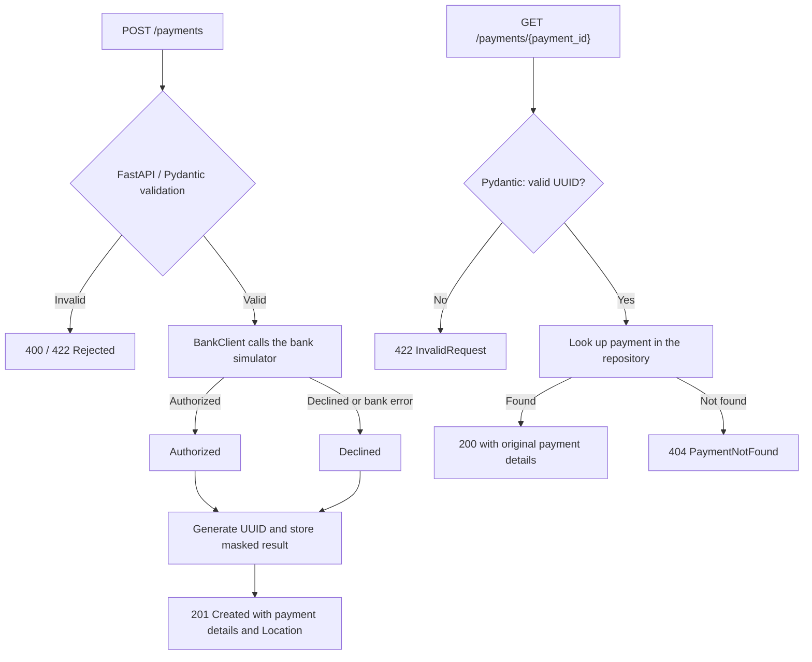

# Payment Gateway

A small FastAPI implementation of the [Checkout.com payment gateway challenge](https://github.com/cko-recruitment#requirements). It validates a payment, calls the supplied bank simulator, stores a masked result, and lets the caller retrieve that result by payment ID. The supplied `.editorconfig` and `imposters/` are unchanged.

## Setup

Miniconda and Docker with Compose are prerequisites. Create a dedicated environment:

```sh
conda env create -f environment.yml
conda activate payment-gateway-challenge
poetry install
```

For an existing environment, run `conda env update -f environment.yml`, activate it and run `poetry install`. The environment provides Python 3.12, Poetry and Node.js for Pyright. Poetry installs locked dependencies into the activated Conda environment.

```sh
make simulator
make run
```

The gateway listens on port 8000 and the bank on port 8080. `main.py` runs one worker with development reload enabled. Reloading or restarting clears all stored payments.

- [Swagger UI](http://localhost:8000/docs)
- [OpenAPI schema](http://localhost:8000/openapi.json)
- `GET /` returns the original template ping response.

| Environment variable | Default | Meaning |
| --- | --- | --- |
| `BANK_BASE_URL` | `http://localhost:8080` | Bank base URL, using HTTP or HTTPS |
| `BANK_TIMEOUT_SECONDS` | `5` | Positive finite timeout for each HTTPX connect/read/write/pool phase |

Export environment variables before starting the app. `.env.example` documents them; `.env` files are not automatically loaded. Invalid bank configuration prevents startup.

## API examples

Create a payment using simulator card details:

```sh
curl -i http://localhost:8000/payments \
  -H 'Content-Type: application/json' \
  -d '{"card_number":"2222405343248877","expiry_month":12,"expiry_year":2030,"currency":"GBP","amount":1050,"cvv":"012"}'
```

This returns HTTP 201, a `Location: /payments/<id>` header, and a result shaped as follows (the ID is generated for each request):

```json
{
  "id": "9025e5b3-6e3a-4d32-bf81-54b492ddc7ed",
  "status": "Authorized",
  "card_number_last_four": "8877",
  "expiry_month": 12,
  "expiry_year": 2030,
  "currency": "GBP",
  "amount": 1050
}
```

Query the ID returned by POST:

```sh
curl -i http://localhost:8000/payments/YOUR_RETURNED_PAYMENT_ID
```

GET returns HTTP 200 and the same seven fields without calling the bank or rechecking the card's expiry. An unknown UUID returns 404; a malformed UUID returns 422.

Invalid payment requests retain FastAPI's HTTP status codes: invalid request encoding (such as invalid UTF-8) returns 400; malformed JSON and field validation errors return 422. Both use a safe `Rejected` response body, without calling the bank or creating a payment.

Expired cards report both `expiry_month` and `expiry_year` in `error.details`, because expiry is a combined rule. Type/range errors identify only the field that failed its constraint.

| Bank outcome / Gateway condition | Gateway HTTP | Gateway payment status | Stored / queryable |
| --- | --- | --- | --- |
| Gateway: invalid request encoding (for example, invalid UTF-8) | 400 | Rejected | No; bank is not called |
| Gateway: invalid JSON or payment fields | 422 | Rejected | No; bank is not called |
| Bank: HTTP 200, `authorized: true` | 201 | Authorized | Yes |
| Bank: HTTP 200, `authorized: false` | 201 | Declined | Yes |
| Bank call: unexpected HTTP status, timeout, connection failure or invalid response | 201 | Declined | Yes |
| Gateway: unexpected programming or storage failure | 500 | No payment status | Creation is not reported as successful |

For requests containing all required fields, the provided simulator authorizes cards ending in `1`, `3`, `5`, `7` or `9`, declines cards ending in `2`, `4`, `6` or `8`, and responds with HTTP 503 for cards ending in `0`. These rules remain in the simulator; every valid payment request goes through the bank client. Invalid gateway requests are rejected before a bank call.

## Design

### Payment flow



`BankClient` combines the expiry fields into `expiry_date` (`MM/YYYY`). HTTP 200 with a boolean `authorized` determines the result. The gateway generates its own UUID and does not store the bank's authorization code.

### Validation rules

Payment POST bodies must be JSON objects with all six fields below. All fields are required and reject `null`.

| Field | JSON type | Rule |
| --- | --- | --- |
| `card_number` | string | 14–19 ASCII digits; leading zeros are preserved |
| `expiry_month` | integer | 1–12 |
| `expiry_year` | integer | 1–9999; combined month and year must not be in the past |
| `currency` | string | Exactly `GBP`, `USD` or `EUR` |
| `amount` | integer | Positive, in minor currency units; `1050` GBP means £10.50 |
| `cvv` | string | 3–4 ASCII digits; leading zeros are preserved |

Integer fields reject strings, floats and booleans. Unknown fields are ignored. No Luhn check is added.

### Key decisions and offline assumptions

- **Pydantic validation** — payment fields and GET UUIDs are validated before route execution. Rejected requests never call the bank or create a payment.
- **Small modules** — routes orchestrate the bank client and repository directly; no extra service layer. One HTTPX client is reused and closed on shutdown.
- **Expiry and amount assumptions** — cards remain valid through their expiry month, checked in UTC. Amounts must be positive integers.
- **Bank errors → Declined** — HTTP errors, timeouts, connection failures and invalid responses become stored declines. This exercise assumption does not prove the bank never processed the payment.
- **Masked results only** — store the last four digits as a string. Full PAN and CVV are excluded from storage, responses, application logs and error details.
- **In-memory repository** — one worker and one event loop; restarting clears payments. The challenge permits storage without a database.
- **No retries or idempotency** — identical POSTs are separate bank attempts with different UUIDs. A timeout may follow a successful authorization, so the gateway does not automatically retry.
- **Exercise scope** — a trusted local caller; authentication, merchant isolation, reconciliation, capture and refunds are outside scope. Authorization alone does not mean settlement.

## Verification

Tests follow three boundaries:

| Directory | What runs for real | What is simulated |
| --- | --- | --- |
| `tests/unit/` | Models, bank settings and `BankClient` | Bank HTTP responses via HTTPX MockTransport |
| `tests/api/` | Routes, validation, error handlers and storage | `BankClient.process` via `mock_bank` |
| `tests/integration/` | Complete application and bank HTTP client | No business methods are mocked; connect to the supplied Docker bank simulator |

```sh
make test                  # Start the Docker bank and run all tests with coverage
make check                 # Lock file, lint/format, types and compilation
```

`make test` starts the supplied Docker bank and runs all tests with coverage. Integration cases cover authorization, decline, bank 503, invalid requests and lookup IDs. Unit and API tests also cover field boundaries, bank failures, safe errors and logs, duplicate requests and lifecycle. The coverage minimum is 95%; warnings fail tests.

Verified on 2026-10-05: **144 cases across 54 test functions**, including **6 Docker integration cases**. `make test` passed **all 144 cases**, with **100% line and branch coverage**. `make check` passed with zero type errors or warnings. The coverage threshold remains 95%.

## Code structure

```text
main.py                              Startup entrypoint
payment_gateway_api/
  __init__.py                        Python package
  app.py                             Routes, lifecycle and dependency wiring
  models.py                          Request validation, response models and status enum
  bank_client.py                     Async bank HTTP calls and response validation
  repository.py                      In-memory save/get
  exceptions.py                      Bank/domain exceptions and safe HTTP error handlers
tests/
  unit/                             Models, bank client and configuration
  api/                              HTTP contracts, errors and application lifecycle
  integration/                      Full flows through the Docker bank simulator
pyproject.toml                       Dependencies and tool configuration
poetry.lock                          Reproducible Python dependencies
environment.yml                      Dedicated Conda environment
Makefile                             Install, run, simulator, test and check
.env.example                         Bank configuration examples
docker-compose.yml                   Supplied bank simulator startup
imposters/                           Supplied bank simulator rules
```

Runtime dependencies are FastAPI, Pydantic, HTTPX and Uvicorn; dependencies and tooling are configured in `pyproject.toml`.
